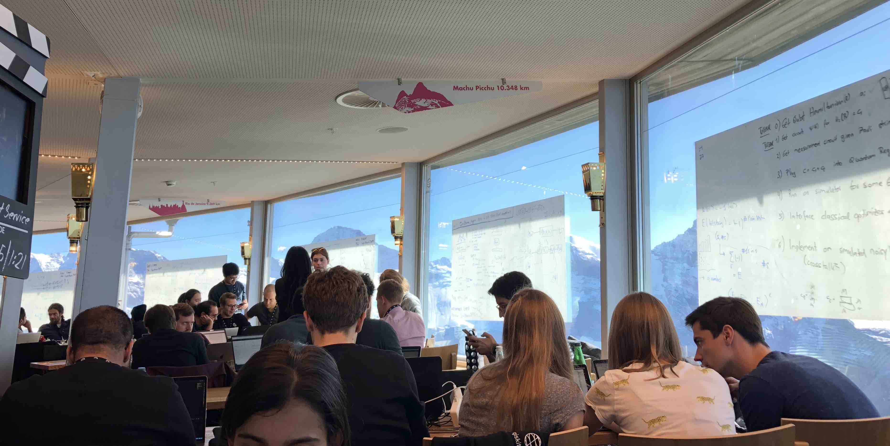
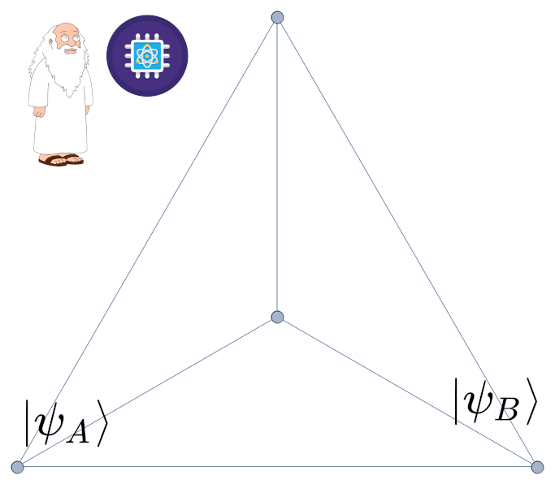

# Quantum Approach to the Rendezvous Problem using Qiskit
This is the repository for Team Rendezvous at the Qiskit Camp 2019 taking place in Mürren, Switzerland. 

## Qiskit Camp 
Qiskit is an open-source quantum computing framework for leveraging today's quantum processors in research, education, and business. Qiskit Camp is a community event organised by IBM where experts in Quantum Computing, students, artists and people from all walks of life come together to have fun and do some quantum together.

A few pictures of the hackathon & the beautiful city of Mürren:

Here is a picture of our team hard at work: 

A picture of the team after the algorithm worked! 

## The Classical Rendezvous Conundrum 
The aim is to build on a quantum advantage by using Grover's algorithm to the Rendezvous Problem. The problem is as follows: Alice & Bob, agree to meet at a park. The only details they have before hand is the date and time of their meeting and a pre-agreed strategy on how they'll find each other within this park. Once Alice and Bob arive at the park, they have no means of communicating with each other. The connundrum they face is which route would lead to the best possible probability of finding the other? How much time would that take? Should they wait before they start or wait at any point during their search?

This problem was first introduced in this [research paper](https://epubs.siam.org/doi/10.1137/S0363012993249195) by Steve Alpern in 1979.

## Our Problem
After seeing that it was going to be very limiting to attack the classical problem with no communication since it would have prevented us from using entangled qubits, we decided to pivot and adapt the problem even further to the quantum setting. Instead of creating an algorithm which two parties could independently apply in a maze to find each other, we now introduce a god with access to a quantum computer who will apply and algorithm to bring these two quantum parties together.
Our maze in this case was the complete graph on four vertices, K4 and after spawning Alice and Bob at two different spots on K4 it was the god's job to make sure they end up in the same spot with some definite probability.

The picture below illustrates the set up of the problem.

## The Implementation

 

At this point we have prepared our state and we are ready to start our Grover Search to amplify the cases where Alice and Bob are sitting on the same vertex.

Our oracle takes an input state and marks the states where the two registers are together, a phase is then applies to amplify these cases.

Our solution has been implemented and can be seen in the python script - Rendezvous.py in the Solution folder. This was the circuit we built.

This [lecture](https://www.scottaaronson.com/qclec/22.pdf) on Grover's algorithm further explains how our algorithm works

A special shoutout to the Qiskit team for all the support throughout this event. Another special mention to the [Qiskit textbook](https://community.qiskit.org/textbook/) which gave us a starting point to build a circuit implementing Grover's search algorithm.

